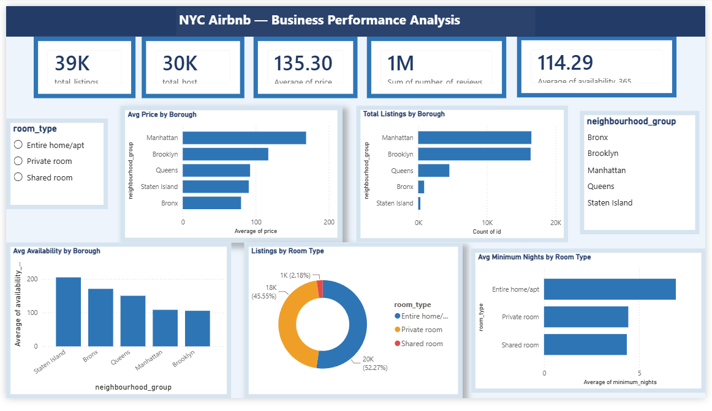

# 🗽 NYC Airbnb — Business Performance Analysis
### Power BI Dashboard Project


---

## 📌 Project Overview

This project analyzes the **NYC Airbnb 2019 dataset** (48,895 listings) to uncover pricing patterns, listing distribution, host behavior, and availability across New York City's five boroughs.

The goal was to build a clean, interactive one-page Power BI dashboard that answers real business questions — useful for hosts, investors, and platform managers.

---

## 📊 Dashboard Preview



---

## 🔧 Tools & Technologies

| Tool | Purpose |
|------|---------|
| Power BI Desktop | Dashboard building and visuals |
| Power Query Editor | Data cleaning and transformation |
| DAX | Custom KPI measures |
| Kaggle | Dataset source |
| Microsoft Excel | Initial data inspection |

---

## 📁 Dataset

| Detail | Value |
|--------|-------|
| File | `AB_NYC_2019.csv` |
| Source | [Kaggle — New York City Airbnb Open Data](https://www.kaggle.com/datasets/dgomonov/new-york-city-airbnb-open-data) |
| Rows | 48,895 listings |
| Columns | 16 |
| Coverage | 5 Boroughs, 221 Neighbourhoods |
| Year | 2019 |

---

## 🧹 Data Cleaning (Power Query)

| Column | Issue | Action Taken |
|--------|-------|--------------|
| `name` | 16 null values | Replaced with "Unknown Listing" |
| `host_name` | 21 null values | Replaced with "Unknown Host" |
| `reviews_per_month` | 10,052 nulls | Replaced with 0 |
| `last_review` | 10,052 nulls | Left as null (date column) |
| `price` | 11 rows with $0 | Filtered out |
| `minimum_nights` | 14 rows > 365 days | Filtered out |

**Final row count after cleaning:** ~48,870 rows

---

## 📐 Data Model

Used a **single flat table model** (`fact_table`) with all 16 columns.

> ⚠️ I originally attempted a star schema with separate dimension tables (`dim_host`, `dim_location`, `dim_roomtype`, `dim_date`) but encountered many-to-many relationship errors due to duplicate values in dimension columns. The single table approach resolved all issues while keeping visuals fully functional.

---

## 📏 DAX Measures

```dax
Total Listings    = COUNTROWS(fact_table)
Total Hosts       = DISTINCTCOUNT(fact_table[host_id])
Average Price     = AVERAGE(fact_table[price])
Total Reviews     = SUM(fact_table[number_of_reviews])
Avg Availability  = AVERAGE(fact_table[availability_365])
```

---

## 🎨 Dashboard Design

- **Layout:** Single-page, 1280×720 canvas
- **Theme:** Navy blue (`#1F3864`) and white
- **Slicers:** Room Type (List style) + Borough (Tile style)
- **Interactivity:** All visuals cross-filter on slicer selection

| Visual | Chart Type |
|--------|-----------|
| Avg Price by Borough | Bar Chart |
| Listings by Room Type | Donut Chart |
| Total Listings by Borough | Bar Chart |
| Avg Availability by Borough | Column Chart |
| Avg Minimum Nights by Room Type | Bar Chart |

---

## 💡 Key Insights

- **Manhattan** has the highest average price at **$196.88/night**; **Bronx** is the most affordable at **$87.50/night**
- **Entire home/apt** listings dominate at **~52%** of total listings
- **Private rooms** (46%) offer a budget-friendly alternative for guests
- **Shared rooms** are rare — only **~2%** of listings
- Top host **Sonder (NYC)** manages **327 listings**, showing corporate players are active
- **17,533 listings** have zero availability — indicating paused or blocked properties

---

## 📂 Files in This Repository

```
📁 NYC-Airbnb-PowerBI/
├── 📊 NYC_Airbnb_Dashboard.pbix       # Power BI project file
├── 🖼️  dashboard.png                  # Dashboard screenshot
├── 📄 NYC_Airbnb_Documentation.docx   # Full project documentation
└── 📝 README.md                       # This file
```

---

## 🚀 How to View

1. Download `NYC_Airbnb_Dashboard.pbix`
2. Open in **Power BI Desktop** (free download from Microsoft)
3. Interact with the slicers to filter by Borough or Room Type

> 📥 Dataset not included due to size — download `AB_NYC_2019.csv` from [Kaggle](https://www.kaggle.com/datasets/dgomonov/new-york-city-airbnb-open-data) and refresh the data source.

